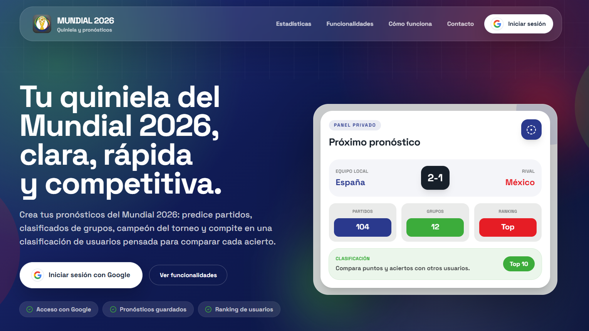

<div align="center">
  

  <h1>Predicciones Mundial 2026</h1>

  <p>
    Plataforma full-stack para crear una quiniela del Mundial 2026, guardar predicciones, calcular puntos y competir en una clasificación entre usuarios.
  </p>

  <p>
    <a href="https://predicciones-mundial-26.vercel.app/" target="_blank" rel="noreferrer">
      
    </a>
  </p>

  <p>
    
    
    
    
    
  </p>
</div>



## Qué es

`Predicciones Mundial 2026` es una aplicación web construida con Next.js y Supabase para gestionar una porra completa del Mundial 2026. Permite iniciar sesión con Google, pronosticar partidos, elegir clasificados por grupo, registrar predicciones globales del torneo y comparar resultados en un leaderboard.

El proyecto combina frontend moderno, lógica de negocio, persistencia en base de datos, autenticación, rutas protegidas, panel de administración e integración con una API externa de datos del Mundial.

## Funcionalidades

- Autenticación con Google mediante Supabase Auth.
- Landing pública con SEO, Open Graph, Twitter Cards y datos estructurados JSON-LD.
- Área privada para usuarios autenticados.
- Predicciones de marcadores para los partidos del Mundial 2026.
- Predicciones de equipos clasificados por grupo.
- Predicciones globales como campeón, máximos goleadores, asistencias, España y extras del torneo.
- Reglas de cierre para bloquear predicciones antes del inicio de partidos o del torneo.
- Sistema de puntuación para partidos, grupos y predicciones globales.
- Clasificación general con desglose de puntos por categoría.
- Comparativa entre usuarios y detalle de predicciones.
- Dashboard de usuario con estado de predicciones, próximos partidos, últimos resultados y evolución en el ranking.
- Panel de administración para sincronizar datos externos, recalcular puntos y resetear estados.
- Integración con una API externa del Mundial 2026 para partidos y clasificaciones de grupos.

## Stack Técnico

| Área           | Tecnología                                                    |
| -------------- | ------------------------------------------------------------- |
| Framework      | Next.js 16 con App Router                                     |
| UI             | React 19, Tailwind CSS 4, Lucide React                        |
| Lenguaje       | TypeScript 5                                                  |
| Backend        | Route Handlers, Server Components y Server Actions de Next.js |
| Base de datos  | Supabase Postgres                                             |
| Autenticación  | Supabase Auth con SSR                                         |
| Datos externos | API WC26 integrada desde `lib/external`                       |
| Gráficas       | Recharts                                                      |
| Calidad        | ESLint, Prettier y Prettier Plugin Tailwind CSS               |
| Paquetes       | pnpm                                                          |

## Arquitectura

```txt
app/
├── (main)/              # Rutas privadas: home, partidos, grupos, globales, ranking, perfil y admin
├── api/admin/           # Endpoints protegidos para sincronización y cálculo de puntos
├── layout.tsx           # Layout raíz
└── page.tsx             # Landing pública

components/
├── admin/               # Paneles de administración
├── globals/             # Formularios de predicciones globales
├── groups/              # Predicciones por grupos
├── home/                # Dashboard del usuario
├── landing/             # Estadísticas públicas
├── layout/              # Header, footer y login
├── leaderboard/         # Tabla, comparativas y desglose
└── matches/             # Lista, filas y modales de partidos

lib/
├── auth/                # Validación de permisos de administrador
├── external/            # Cliente para la API del Mundial 2026
├── repositories/        # Acceso a datos de Supabase
├── scoring/             # Reglas, cálculo y reseteo de puntuaciones
└── supabase/            # Clientes browser, server y admin

supabase/
└── init-v2.sql          # Esquema SQL principal de la base de datos
```

## Puntuación

La aplicación incluye una lógica de puntuación separada en `lib/scoring`, diseñada para mantener las reglas fuera de la interfaz y facilitar recalculados desde el panel de administración.

| Bloque   | Ejemplos de puntuación                                                    |
| -------- | ------------------------------------------------------------------------- |
| Partidos | Resultado exacto, ganador y diferencia, solo ganador o goles de un equipo |
| Grupos   | Equipos clasificados acertados y bonus por grupo perfecto                 |
| Globales | Campeón, goleadores, asistentes, España y predicciones especiales         |

## Panel de Administración

Las rutas de administración están protegidas con `requireAdmin` y utilizan un cliente Supabase con permisos elevados. Desde el panel se pueden ejecutar acciones sensibles como:

- Descargar partidos desde la API externa.
- Sincronizar un partido concreto.
- Calcular puntos de partidos jugados.
- Resetear puntuaciones de partidos.
- Descargar clasificados de grupos.
- Calcular o resetear puntos de grupos.
- Gestionar el cálculo de predicciones globales.

## Variables de Entorno

Crea un archivo `.env.local` con las variables necesarias para Supabase y la API externa:

```env
NEXT_PUBLIC_SUPABASE_URL=your_supabase_project_url
NEXT_PUBLIC_SUPABASE_PUBLISHABLE_KEY=your_supabase_publishable_key
SUPABASE_SECRET_KEY=your_supabase_secret_key
WC26_API_URL=your_world_cup_api_url
WC26_API_KEY=your_world_cup_api_key
```

## Instalación y Uso

Clona el repositorio e instala dependencias:

```bash
pnpm install
```

Prepara la base de datos ejecutando el SQL de `supabase/init-v2.sql` en tu proyecto de Supabase.

Arranca el entorno de desarrollo:

```bash
pnpm dev
```

La aplicación se sirve en:

```txt
http://localhost:3001
```

## Scripts Disponibles

| Comando             | Descripción                                       |
| ------------------- | ------------------------------------------------- |
| `pnpm dev`          | Ejecuta Next.js en desarrollo en el puerto `3001` |
| `pnpm build`        | Genera la build de producción                     |
| `pnpm start`        | Sirve la build de producción en el puerto `3001`  |
| `pnpm lint`         | Ejecuta ESLint                                    |
| `pnpm format`       | Formatea el proyecto con Prettier                 |
| `pnpm format:check` | Comprueba el formato sin modificar archivos       |

## Detalles Destacables

- Separación clara entre UI, repositorios, autenticación, integración externa y scoring.
- Uso de Server Components para cargar datos en el servidor y reducir lógica innecesaria en cliente.
- Clientes Supabase diferenciados para navegador, servidor y operaciones administrativas.
- Reglas de negocio encapsuladas para poder recalcular puntos de forma controlada.
- Experiencia visual responsive con Tailwind CSS.
- Landing optimizada para presentación pública del proyecto.
- Arquitectura preparada para datos reales del Mundial 2026.
